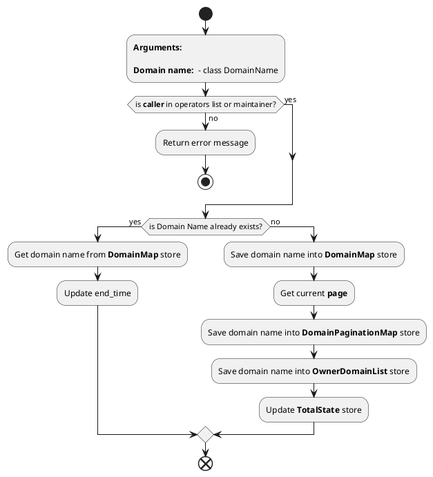
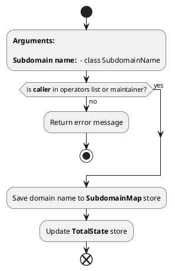

# **Database Contract**

1. Endpoint name: *****save_domain_name***** <br>
   
   Arguments: <br>
    - **arg_database_domain_name** - The domain name to be saved (**DomainName**)
  
   Return value: <br>
    - **void;** <br><br>
  
   **Implementation:** <br>


<hr> <br>

2. Endpoint name: *****save_subdomain_name***** <br>
    Arguments: <br>
    - **arg_database_subdomain_name** - The sub domain name to be added(**SubdomainName**)
  
   Return value: <br>
    - **void;** <br><br>
  
   **Implementation:** <br>


<hr> <br>

3. Endpoint name: *****remove_domain_name***** <br>
    Arguments: <br>
    - **arg_database_domain_name** - The domain name should be removed(**DomainName**)
  
   Return value: <br>
    - **void;** <br><br>
  
   **Implementation:** <br>

```plantuml

start

:**Arguments:**

**Domain name: ** - class DomainName;

if (is **caller** in operators list or maintainer?) then (yes)
else (no)
    :Return error message;
    stop
endif
:Remove domain name from **DomainMap** store;

:Get Page for the domain name;

:Remove the domain name by the page;

:Clear subdomains;

:Remove record from OwnerDomainList;

:Update **TotalState** store (decrement it);

end

```

<hr> <br>

4. Endpoint name: *****remove_subdomain_name***** <br>
    Arguments: <br>
    - **arg_database_domain_name** - The domain name is used for finding the subdomain name(**String**)
    - **arg_database_subdomain_name** - The sub domain name should be removed(**String**)
  
   Return value: <br>
    - **void;** <br><br>
  
   **Implementation:** <br>

```plantuml

start

:**Arguments:**

**Domain name: ** - String
**Subomain name: ** - String;

:Remove record from **Subdomain Map** store;

:Remove subdomain name from **SubdomainList** store by domain name;

:Update **TotalState** store (decrement subomains count);

end

```

<hr> <br>

5. Endpoint name: *****set_domain_ownership***** <br>
    Arguments: <br>
    - **arg_database_domain_name** - The Domain name whichs owner should be changed(**String**)
    - **arg_database_owner** - The new owner should be set for the domain name(**PublicKey**)
  
   Return value: <br>
    - **void;** <br><br>
  
   **Implementation:** <br>


```plantuml
start

:**Arguments:**

**Domain name: ** - String
**Owner: ** - PublicKey;

:Update owner DomainMap for the Domain name;

end
```

<hr> <br>

6. Endpoint name: *****set_domain_expiration***** <br>
    Arguments: <br>
    - **arg_database_domain_name** - The Domain name whichs expiration time should be changed(**String**)
    - **arg_database_expiration_date** - The new expiration time should be set for the domain name(**AccountHash**)
  
   Return value: <br>
    - **void;** <br><br>
  
   **Implementation:** <br>


```plantuml
start

:**Arguments:**

**Domain name: ** - String
**Owner: ** - AccountHash;

:Update time in DomainMap for the Domain name;

end
```

<hr> <br>

7. Endpoint name: *****set_domain_resolver***** <br>
    Arguments: <br>
    - **arg_database_domain_name** - The Domain name whichs resolver address should be changed(**String**)
    - **arg_database_resolver** - The new resolver address should be set for the domain name(**AccountHash**)
  
   Return value: <br>
    - **void;** <br><br>
  
   **Implementation:** <br>


```plantuml
start

:**Arguments:**

**Domain name:** - String
**Resolver:** - PublicKey;

:Update resolver in DomainMap for the Domain name;

end
```


<hr> <br>

8. Endpoint name: *****set_subdomain_resolver***** <br>
    Arguments: <br>
    - **arg_database_subdomain_name** - The Subomain name whichs resolver address should be changed(**String**)
    - **arg_database_resolver** - The new resolver address should be set for the Subdomain name(**AccountHash**)
  
   Return value: <br>
    - **void;** <br><br>
  
   **Implementation:** <br>


```plantuml
start

:**Arguments:**

**Subdomain name:** - String
**Resolver:** - PublicKey;

:Update resolver in SubdomainMap for the Subdomain name;

end
```

<hr> <br>