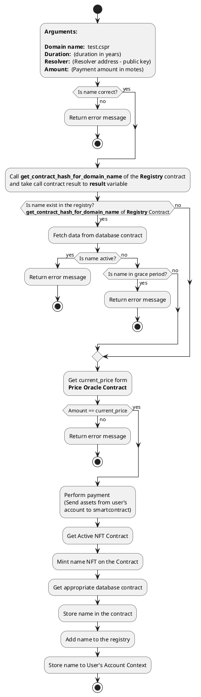
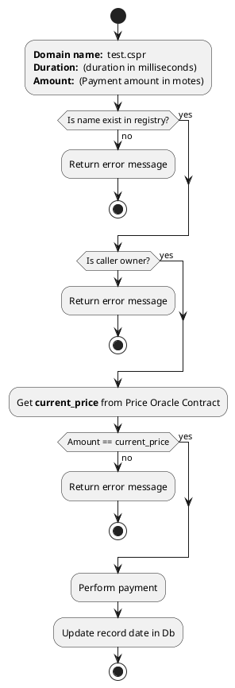
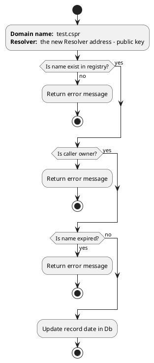
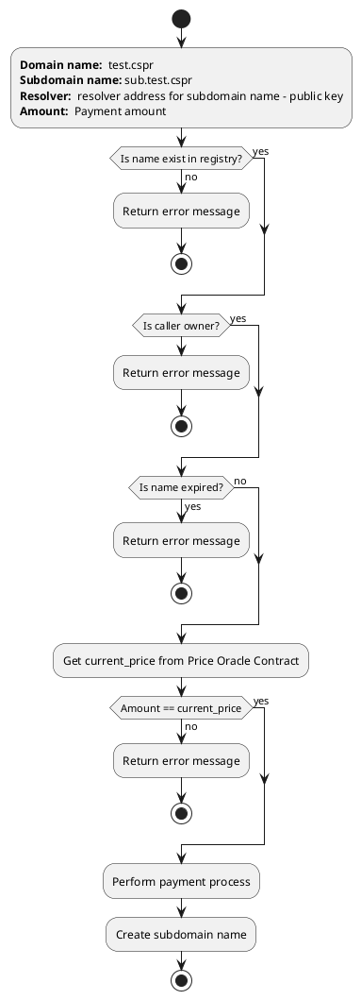
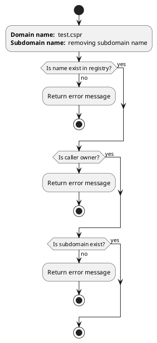
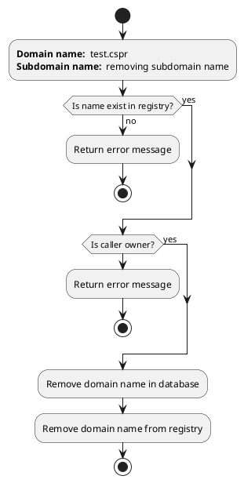
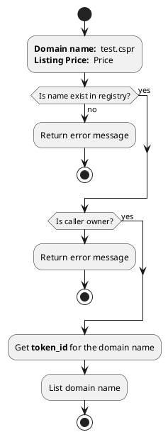

# ** Main Contract **
1) Endpoint name: *****register_domain_name*****  
   
   Arguments:  
    - **arg_main_domain_name** - Creating domain name
    - **arg_main_duration** - Duration for the name (in years)
    - **arg_main_resolver_address** - Resolver address for the name
    - **arg_main_amount** - Payment amount for the name   
  
   Return value:  
    - **void;**   
  
   **Implementation:**  

  

2) Endpoint name: *****extend*****  
   
   Arguments:  
    - **arg_main_domain_name** - Extending domain name
    - **arg_main_duration** - Duration (in milliseconds)
    - **arg_main_amount** - Payment amount for the name     
   Return value:  
    - **void;**   
  
   **Implementation:** 

  

3) Endpoint name: *****domain_set_resolver_address*****  
   
   Arguments:  
    - **arg_main_domain_name** - Domain name
    - **arg_main_resolver_address** - the new Resolver address
   Return value:  
    - **void;**   
  
   **Implementation:** 

  

4) Endpoint name: *****register_subdomain_name*****  
   
   Arguments:  
    - **arg_main_domain_name** - Domain name
    - **arg_main_subdomain_name** - Creating Subdomain name
    - **arg_main_resolver_address** - the new Resolver address
    - **arg_main_amount** - Payment amount    
   
   Return value:  
    - **void;**   
  
   **Implementation:** 

  

5) Endpoint name: *****remove_subdomain_name*****  
   
   Arguments:  
    - **arg_main_domain_name** - Domain name
    - **arg_main_subdomain_name** - Removing Subdomain name
   
   Return value:  
    - **void;**   

   **Implementation:** 

6) Endpoint name: *****remove_domain_name*****  
   
   Arguments:  
    - **arg_main_domain_name** - Removing Domain name
   
   Return value:  
    - **void;**   
  
   **Implementation:** 

7) Endpoint name: *****list*****  
   
   Arguments:  
    - **arg_main_domain_name** - Listing Domain name
    - **arg_main_price** - Listing price
   
   Return value:  
    - **void;**   
  
   **Implementation:** 

8) Endpoint name: *****unlist*****  
   
   Arguments:  
    - **arg_main_domain_name** - UnListing Domain name    
   
   Return value:  
    - **void;**   
  
   **Implementation:** 

9) Endpoint name: *****buy*****  
   
   Arguments:  
    - **arg_main_domain_name** - Domain name
    - **arg_main_subdomain_name** - Creating Subdomain name
    - **arg_main_resolver_address** - the new Resolver address
    - **arg_main_amount** - Payment amount    
   
   Return value:  
    - **void;**   
  
   **Implementation:** 

10) Endpoint name: *****transfer*****  
   
   Arguments:  
    - **arg_main_domain_name** - Domain name
    - **arg_main_subdomain_name** - Creating Subdomain name
    - **arg_main_resolver_address** - the new Resolver address
    - **arg_main_amount** - Payment amount    
   
   Return value:  
    - **void;**   
  
   **Implementation:** 

