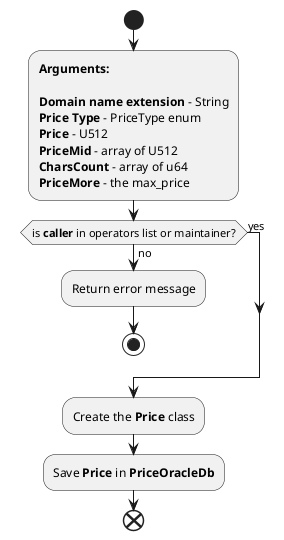
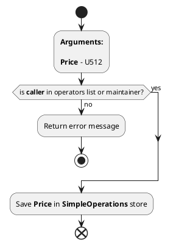
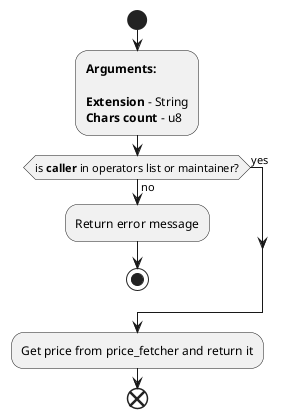
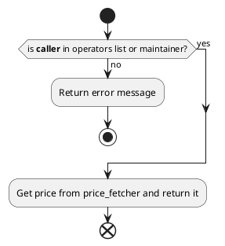

# **PriceOracle Contract**

1. Endpoint name: *****set_price*****  
   
   Arguments:  
    - **arg_price_oracle_extension** - Domain name Extension (**String**);
    - **arg_price_oracle_price_type** - PriceType enum
    - **arg_price_oracle_price** - price is used for both types: for fixed type it is the main price, for dynamic type it is min_price;
    - **arg_price_oracle_price_mid** - it is used for dynamic type, vec of U512 type;
    - **arg_price_oracle_chars_count_mid** - used for dynamic type, length should match with the length of price_mid;
    - **arg_price_oracle_price_more** - used for dynamic type and represents tha max_price;
  
   Return value:  
    - **void;**   
  
   **Implementation:**  

  

2. Endpoint name: *****set_price_simple_operations*****  
   
   Arguments:  
    - **arg_price_oracle_price** - price is used for both types: for fixed type it is the main price, for dynamic type it is min_price;
  
   Return value:  
    - **void;**   
  
   **Implementation:**  

  

3. Endpoint name: *****get_price*****  
   
   Arguments:  
    - **arg_price_oracle_extension** - Domain name Extension (**String**);
    - **arg_price_oracle_chars_count** - u8;
  
   Return value:  
    - **U512;**   
  
   **Implementation:**  

  

4. Endpoint name: *****get_price_simple_operations*****  
   
   Arguments:      
  
   Return value:  
    - **U512;**   
  
   **Implementation:**  

  