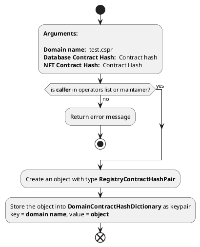
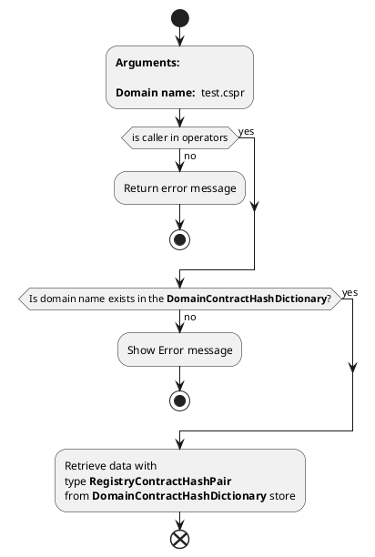
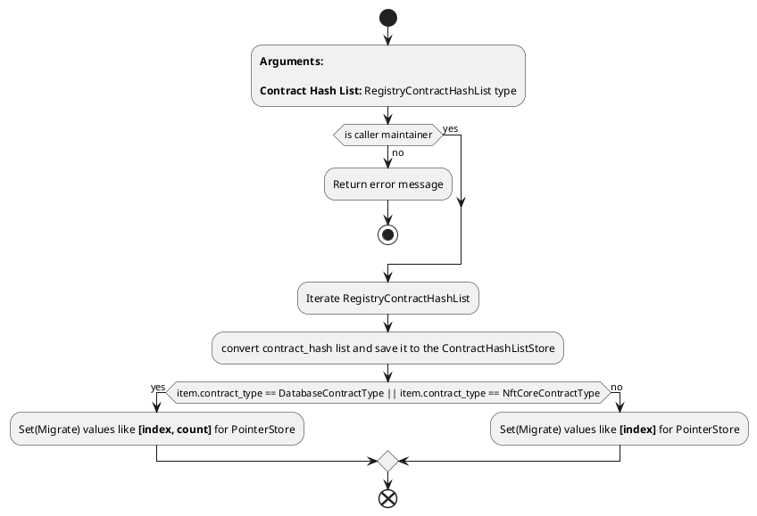
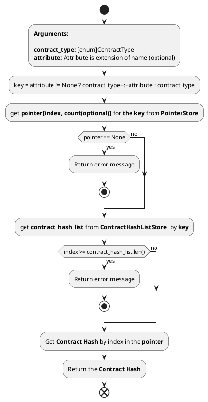
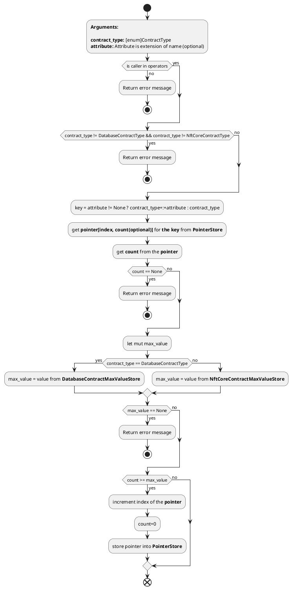
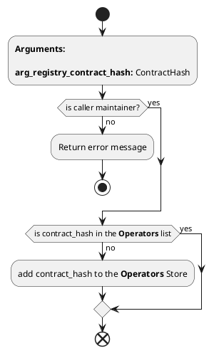
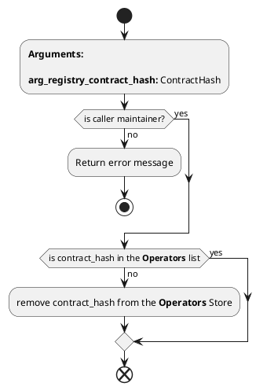

# **Registry Contract**

1. Endpoint name: *****map_domain_name_to_contract_hash***** <br>
   
   Arguments: <br>
    - **arg_registry_domain_name** - The domain name required for mapping
    - **arg_registry_database_contract_hash** - Database Contract Hash
    - **arg_nft_contract_hash** - NFT Contract Hash
  
   Return value: <br />
    - **void;** <br /><br />
  
   **Implementation:** <br />


<hr> <br>

2. Endpoint name: *****get_contract_hash_for_domain_name***** <br />

    Arguments: <br>
    - **arg_registry_domain_name** - domain name key for requesting data
    
    Return value: <br>
    - **RegistryContractHashPair** <br><br>
  
   **Implementation:** <br />



<hr> <br>

1. Endpoint name: *****set_contract_hash_list***** <br />
    
    Arguments: <br>
    - ** arg_registry_contract_hash_list ** - represents list of contracts **RegistryContractHashList** <br><br>
    
    Return value:
    - **void;** <br><br>
  
    **Implementation:**


<hr> <br>

1. Endpoint name: *****get_contract***** <br>
   
   Arguments: <br>
   - **arg_registry_contract_type** - ContractType
   - **arg_registry_attribute** - attribute is used for database contract (Optional) <br><br>

    Return value:
    - Actual contract hash <br><br>
    
    **Implementation:**

```plantuml
start

:**Arguments:** 

**Contract Type:** [enum]ContractType type
**Attribute: ** attribute (extension);

if (is caller in operators) then (yes)
else (no)
    :Return error message;
    stop
endif

if (contract_type == db && attribute == None) then(yes)
    :Return error message;
    stop;
else (no)
endif

:Convert **ContractType** to **RegistryContractType**;

:Call **getter_method** (The Diagram below);

:Get ContractHash by the **getter_method** and return it;

end
```

## Getter Method <br>




<hr> <br>

5. Endpoint name: *****increment_count_of_contract***** <br>
   
   Arguments: <br>
   - **arg_registry_contract_type** - ContractType
   - **arg_registry_attribute** - attribute is used for database contract (Optional) <br><br>

    Return value:
    - void <br><br>
    
    **Implementation:**



<hr> <br><br>


1. Endpoint name: *****add_operator***** <br>
   
   Arguments: <br>
   - **arg_registry_contract_hash** - ContractHash
   <br><br>

    Return value:
    - void <br><br>
    
    **Implementation:**



<hr> <br><br>

7. Endpoint name: *****remove_operator***** <br>
   
   Arguments: <br>
   - **arg_registry_contract_hash** - ContractHash
   <br><br>

    Return value:
    - void <br><br>
    
    **Implementation:**



<hr> <br><br>