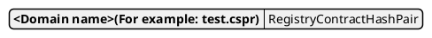

# Storage of registry contract representation

## 1) **DomainContractHashDictionary** - Dictionary

Key: **KEY_REGISTRY_DOMAIN_CONTRACT_MAP**  

 
 

## 2) **ContractHashListStore** - KeyValueStore

Key: **contract_type+attribute** 
Value: **ContractHash[]**

 
 

## 3) **PointerStore** - KeyValueStore

Key: **contract_type+attribute** 
Value: **[class]RegistryPointer**

 
 

## 4) **DatabaseContractMaxValueStore** - KeyValueStore

Key: **key_registry_database_contract_max_count_value** 
Value: **u16** type value

 
 

## 5) **NftCoreContractMaxValueStore** - KeyValueStore

Key: **key_registry_nft_core_contract_max_count_value** 
Value: **u16** type value

## 6) **Operators** - KeyValueStore

Key: **key_registry_operators**
Value: ** ContractHash[] **