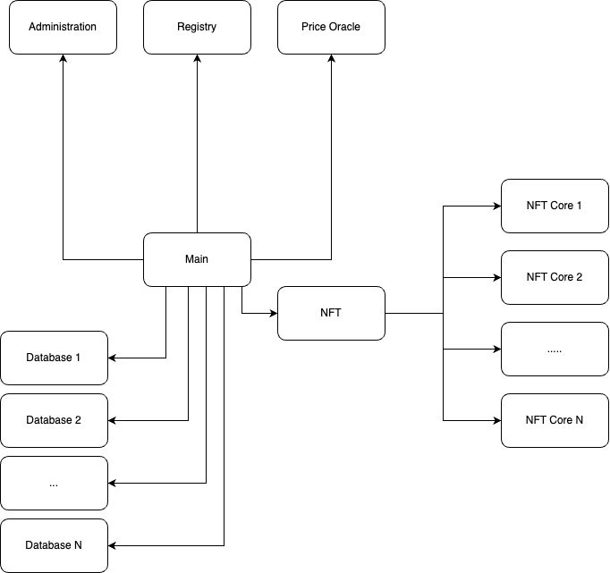
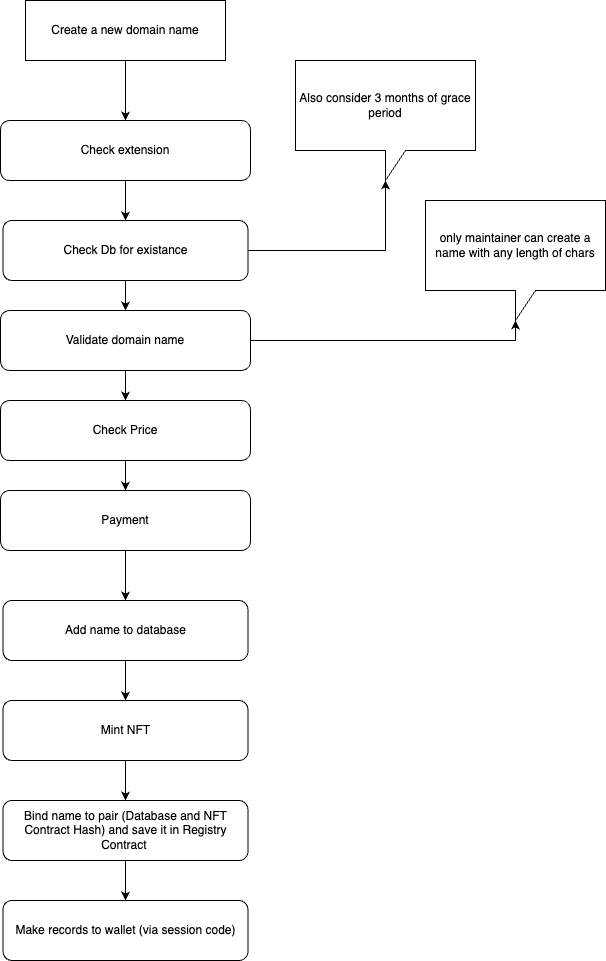
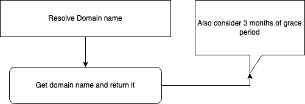
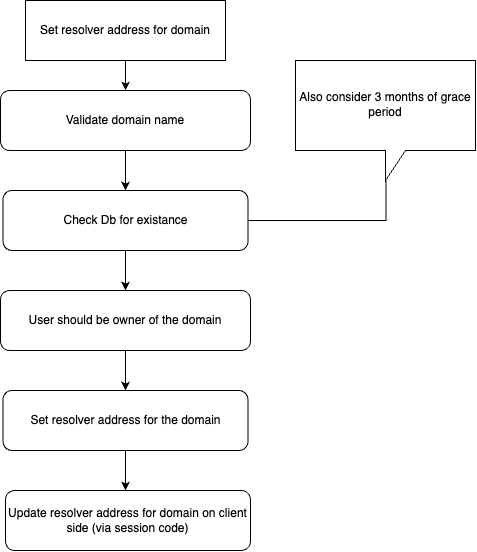
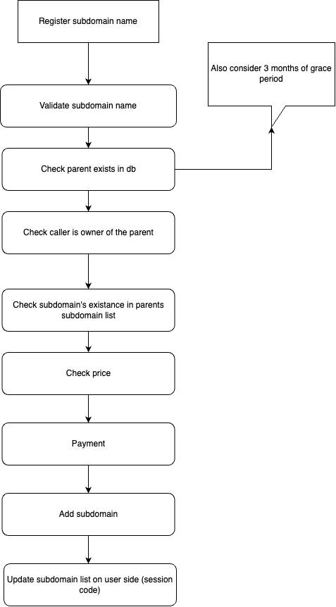
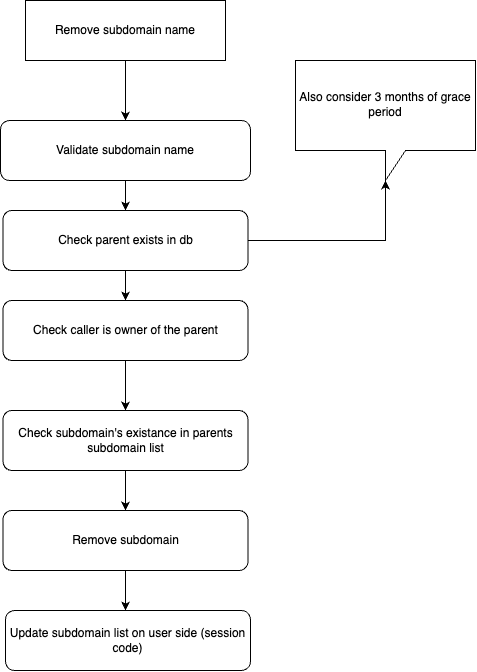
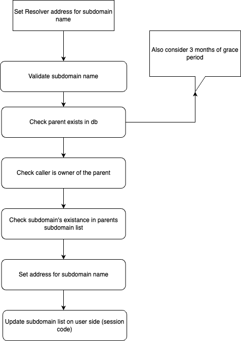

# Requirements
- support multiple extension
- domain name (create, burn, list, buy, unlist)
- subdomain support (create, remove)
- NFT based name service
- Set/Update Resolve Address for domain/subdomain
- Central Administration and Pricing system
- Scaleable (Horizontal)
- Secure

# [Architecture](./contract-schema.png)

## Smartcontract List:

1. Administration
2. Registry
3. Database
4. NFT
5. NFT-Core
6. Price Oracle
7. Main

## Contracts Description

### Administration Contract

It has following responsibilities:

- Authority System 
- Extensions list
- min allowed name registration characters count per extension
- domain names count in database contract (for example 10 000 per contract)
- Contract List and its management
  
### Registry Contract

It has following responsibilities:

- binding domain name to pair of contracts (Database and NFT)

### Database Contract

It holds all registered domain names and it is per extension. Horizontally scalable.

- CRUD for Domain Name
- CRUD for Subdomain Name
- Domain names list
- Subdomains list
- Total count of domains and pagination

### NFT Contract

It is not only wrapper contract for NFT-Core contract, also it gives additional functionality. Beside minting, burning, transferring NFT it can list, unlist and buy

- list
- unlist
- buy

### NFT-Core Contract

NFT store. When user creates a new domain name in this contract will be minted a new NFT for that domain name. It is like database contract per extension contract.

- mint
- burn
- transfer

# Main functionality

### 1. Create domain name

### 2. Resolve domain name

### 3. Set resolver address for domain

### 4. Create subdomain name

### 5. Remove subdomain name

### 6. Set Resolver address for subdomain
